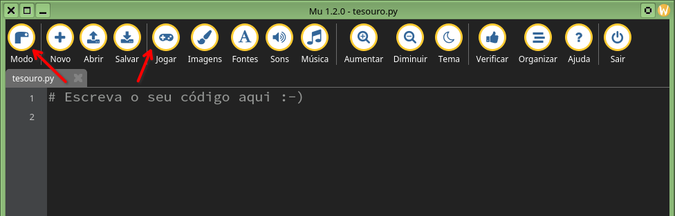

Pygame Zero
---

# Jogo do tesouro

* O jogo desta aula consiste num navio pirata que deverá coletar moedas que caem do céu e desviar de bombas precedentes do mesmo local.

*  Vamos implementar desde os controles do barco até os eventos que ocorrem quando moedas são coletadas (pontuação aumenta) bem como quando algum explosivo acerta o barco (número de vidas diminui).

* Finalmente iremos implementar uma tela de _Game Over_ para dar entrada quando as vidas acabarem.

* Se quiser jogar novamente, sopre o cartucho e reinicie o jogo!

<!-- end_slide -->

Pygame Zero
---

# Iniciando um jogo
## Construa o arquivo `tesouro.py` e execute
```bash
pgzero tesouro.py
```
## Ou no `mu_editor`, selecione o modo `Pygame Zero` e clique em jogar, botões em destaque.



<!-- end_slide -->

Pygame Zero
---

# Tamanho de tela do jogo
```python
WIDTH = 800
HEIGHT = 600
```

# Desenhe tudo na tela

## Elementos gráficos sempre no diretório `images`

```python
def draw():
    screen.blit('background',(0,0))
```

<!-- end_slide -->

Pygame Zero (`tesouro.py`)
---

# Até o momento `tesouro.py`

```python
WIDTH = 800
HEIGHT = 600


def draw():
    screen.blit('background')
```
clique em jogar!

<!-- end_slide -->

Pygame Zero (`tesouro.py`)
---

# Agora adicione o navio

```python
ship = Actor('ship', midbottom=(400,550))
```

1. `ship` é o nome dado ao objeto no jogo;
2. `Actor` é o tipo de classe que define o objeto;
3. `midbottom` é um atributo da classe `Actor` que define onde será posicionado o ponto inferior central do objeto:
  - `midbottom` recebe uma _tupla_ com coordenadas em pixel, `x=400` e `y=550`

# Desenhe
```python
def draw():
    screen.blit('background',(0,0))
    ship.draw()
```

# Atualize a imagem
```python
def update():
    if keyboard.left:
        ship.x -= 7
        if ship.left < 0: # Parede à esquerda
            ship.left = 0
```

<!-- end_slide -->

Pygame Zero (`tesouro.py`)
---

# Até o momento `tesouro.py`
```python
WIDTH = 800
HEIGHT = 600

ship = Actor('ship', midbottom=(400,550))


def draw():
    screen.blit('background',(0,0))
    ship.draw()


def update():
    if keyboard.left:
        ship.x -= 7
        if ship.left < 0: # Parede à esquerda
            ship.left = 0
```
clique em jogar!

<!-- end_slide -->

Pygame Zero (`tesouro.py`)
---

# Complete o movimento

```python
def update():
    if keyboard.left:
        ship.x -= 7
        if ship.left < 0: # Parede à esquerda
            ship.left = 0
    if keyboard.right:
        ship.x += 7
        if ship.right > WIDTH: # Parede à direita
            ship.right = WIDTH
```

# Insira uma moeda

## Posição horizontal será aleatória
Para isso faça um `import` antes

```python
from random import randint
```

## Agora defina ela e a posicione

```python
coin = Actor('coin', midtop=(randint(20,780),0))
```
A estrutura é muito semelhante ao navio, porém aqui usamos `midtop` que posiciona o ponto central e do topo da imagem.

<!-- end_slide -->

Pygame Zero (`tesouro.py`)
---

# Desenhe a moeda

```python
def draw():
    ...
    coin.draw()
```

# E atualize ela no jogo

```python
def update():
    ...
    coin.y += 7
    if coin.bottom > HEIGHT:
        coin.midbottom = randint(20,780), 0
```

<!-- end_slide -->

Pygame Zero (`tesouro.py`)
---

# Até o momento `tesouro.py`

```python
from random import randint

WIDTH = 800
HEIGHT = 600

ship = Actor('ship', midbottom=(400,550))

coin = Actor('coin', midtop=(randint(20,780),0))


def draw():
    screen.blit('background',(0,0))
    ship.draw()
    coin.draw()


def update():
    if keyboard.left:
        ship.x -= 7
        if ship.left < 0: # Parede à esquerda
            ship.left = 0
    if keyboard.right:
        ship.x += 7
        if ship.right > WIDTH: # Parede à direita`
            ship.right = WIDTH

    coin.y += 7
    if coin.bottom > HEIGHT:
        coin.midbottom = randint(20,780), 0
```
clique em jogar!

Não esqueça de comentar cada trecho do código com informações úteis.

<!-- end_slide -->

Pygame Zero (`tesouro.py`)
---

# As bombas possuem a mesma estrutura de uma moeda

```python
bomb = Actor('bomb', midtop=(randint(20,780),0))
```

# E a dinâmica também idêntica

**Não se esqueça de desenhar a bomba!**

```python
def update():
    ...
    bomb.y += 7
    if bomb.bottom > HEIGHT:
        bomb.midtop = randint(20,780), 0
```

<!-- end_slide -->

Pygame Zero (`tesouro.py`)
---

# Até o momento

<!-- column_layout: [1, 1] -->

<!-- column: 0 -->

## Primeira parte, definições e desenho
```python
from random import randint

WIDTH = 800
HEIGHT = 600

ship = Actor('ship', midbottom=(400,550))

coin = Actor('coin', midtop=(randint(20,780),0))

bomb = Actor('bomb', midtop=(randint(20,780),0))


def draw():
    screen.blit('background',(0,0))
    ship.draw()
    coin.draw()
    bomb.draw()
```

<!-- column: 1 -->

## Segunda parte, atualizações

```python
def update():
    if keyboard.left:
        ship.x -= 7
        if ship.left < 0: # Parede à esquerda
            ship.left = 0
    if keyboard.right:
        ship.x += 7
        if ship.right > WIDTH: # Parede à direita`
            ship.right = WIDTH

    coin.y += 7
    if coin.bottom > HEIGHT:
        coin.midtop = randint(20,780), 0
        
    bomb.y += 7
    if bomb.bottom > HEIGHT:
        bomb.midtop = randint(20,780), 0
```
<!-- reset_layout -->

<!-- end_slide -->

Pygame Zero (`tesouro.py`)
---

# Implementando pontuação e vidas!

## Variável global para os pontos

Pontuação zerada inicialmente.

```python
score = 0
```

## Variável global para vidas
Três vidas para início de conversa.
```python
life = 3
```

## Navio "colide" com moeda

```python
def update():
    global score
    ...
    if ship.colliderect(coin):
        score += 1
        sounds.coleta.play()
```

## Navio "colide" com bomba

```python
def update():
    global score, life
    ...
    if ship.colliderect(bomb):
        life -= 1
        sounds.explosao.play()
```

<!-- end_slide -->

Pygame Zero (`tesouro.py`)
---

# Até o momento

<!-- column_layout: [1, 1] -->

<!-- column: 0 -->

## Primeira parte, definições e desenho

```python
from random import randint

WIDTH = 800
HEIGHT = 600

ship = Actor('ship', midbottom=(400,550))

coin = Actor('coin', midtop=(randint(20,780),0))

bomb = Actor('bomb', midtop=(randint(20,780),0))

score = 0
life = 3


def draw():
    screen.blit('background',(0,0))
    ship.draw()
    coin.draw()
    bomb.draw()
```

<!-- column: 1 -->

## Segunda parte, atualizações

```python
def update():
    global score, life

    if keyboard.left:
        ship.x -= 7
        if ship.left < 0: # Parede à esquerda
            ship.left = 0
    if keyboard.right:
        ship.x += 7
        if ship.right > WIDTH: # Parede à direita`
            ship.right = WIDTH

    coin.y += 7
    if coin.bottom > HEIGHT:
        coin.midtop = randint(20,780), 0
        
    bomb.y += 7
    if bomb.bottom > HEIGHT:
        bomb.midtop = randint(20,780), 0
    
    if ship.colliderect(coin):
        score += 1
        sounds.coleta.play()
    
    if ship.collirderect(bomb):
        life -= 1
        sounds.explosao.play()
```
<!-- reset_layout -->

<!-- end_slide -->

Pygame Zero (`tesouro.py`)
---

# Para corrigir o toque do som, devemos sumir com o objeto após a colisão no mesmo ponto do "toque o som"

## Navio "colide" com moeda

```python
def update():
    ...
    if ship.colliderect(coin):
        coin.midtop = randint(20,780), 0
        score += 1
        sounds.coleta.play()
```

## Navio "colide" com bomba

```python
def update():
    ...
    if ship.colliderect(bomb):
        bomb.midtop = randint(20,780), 0
        life -= 1
        sounds.explosao.play()
```

Note que reposicionamos os objetos assim que a colisão foi detectada, isso impede que a colisão seja detectada em mais quadros, além do momento imediato da colisão.

<!-- end_slide -->

Pygame Zero (`tesouro.py`)
---

Precisamos agora mostrar na tela a pontuação e a vida, afinal as variáveis `score` e `life` estão sendo modificadas, mas ninguém está vendo isso

```python
def draw():
    global score, life
    ...
    screen.draw.text(f'Pontos: {score}', (5,5), fontname='pixel', color=(255,255,255), fontsize=15)
    screen.draw.text(f'Vidas: {life}', (690,5), fontname='pixel' ,color=(255,255,255), fontsize=15)
```

O problema agora é que ao ser atingido pelas bombas, a vida começa a ficar negativa, seria mais interessante que quando ela for igual a zero o jogo dê um _game over_, e se possível que a nova tela diga a pontuação e forneça um botão para reiniciar o jogo.

<!-- end_slide -->

Pygame Zero (`tesouro.py`)
---

# Game Over

O desenho do jogo irá depender da variável global _game_over_, atualizada no momento que `life` atingir o valor nulo
```python
game_over = False


def draw():
    global score, life, game_over

    if not game_over:
        bg.draw()
        ship.draw()
        coin.draw()
        bomb.draw()
        screen.draw.text(f'Pontos: {score}', (5,5), fontname='pixel', color=(255,255,255), fontsize=15)
        screen.draw.text(f'Vidas: {life}', (690,5), fontname='pixel' ,color=(255,255,255), fontsize=15)
    
    else:
        bg.draw()
        screen.draw.text(f'Game Over', (400,300), fontname='pixel', color=(255,255,255), fontsize=30)
        screen.draw.text(f'Pontos: {score}', (370,350), fontname='pixel', color=(255,255,255), fontsize=15)
        screen.draw.text(f'Vidas: {score}', (370,370), fontname='pixel', color=(255,255,255), fontsize=15)
```

A dinâmica da função `update` também dependerá do valor dessa variável de fim de jogo.

```python
def update():
    global score, life, game_over

    if not game_over:
        # faz tudo que já estava fazendo
        # só que agora tabulado aqui dentro
        ...
        if life == 0:
            game_over = True
```
<!-- end_slide -->

Pygame Zero (`tesouro.py`)
---

# Até o momento

<!-- column_layout: [1, 1] -->

<!-- column: 0 -->

## Primeira parte, definições e desenho

```python
from random import randint

WIDTH = 800
HEIGHT = 600

ship = Actor('ship', midbottom=(400,550))

coin = Actor('coin', midtop=(20,780))

bomb = Actor('bomb', midtop=(20,780))

score = 0
life = 3
game_over = False


def draw():
    global score, life, game_over

    if not game_over:
        screen.blit('background',(0,0))
        ship.draw()
        coin.draw()
        bomb.draw()
    else:
        screen.blit('background',(0,0))
        screen.draw.text(f'Game Over', (400,300), fontname='pixel',\
            color=(255,255,255), fontsize=30)
        screen.draw.text(f'Pontos: {score}', (370,350), fontname='pixel',\
            color=(255,255,255), fontsize=15)
        screen.draw.text(f'Vidas: {score}', (370,370), fontname='pixel',\
            color=(255,255,255), fontsize=15)
```

<!-- column: 1 -->

## Segunda parte, desenho e atualizações

```python
def update():
    global score, life, game_over

    if not game_over:
        if keyboard.left:
            ship.x -= 7
            if ship.left < 0: # Parede à esquerda
                ship.left = 0
        if keyboard.right:
            ship.x += 7
            if ship.right > WIDTH: # Parede à direita`
                ship.right = WIDTH

        coin.y += 7
        if coin.bottom > HEIGHT:
            coin.midtop = randint(20,780), 0
            
        bomb.y += 7
        if bomb.bottom > HEIGHT:
            bomb.midtop = randint(20,780), 0
        
        if ship.colliderect(coin):
            coin.midtop = randint(20,780), 0
            score += 1
            sounds.coleta.play()
        
        if ship.collirderect(bomb):
            bomb.midtop = randint(20,780), 0
            life -= 1
            sounds.explosao.play()
        
        if life == 0:
            game_over = True
```

<!-- reset_layout -->

O jogo já pode ser jogado em sua plenitude, falta coisas mínimas como uma opção de reiniciar.
Antes disso vamos fazer uso de classes para deixar ele mais bem estruturado.
