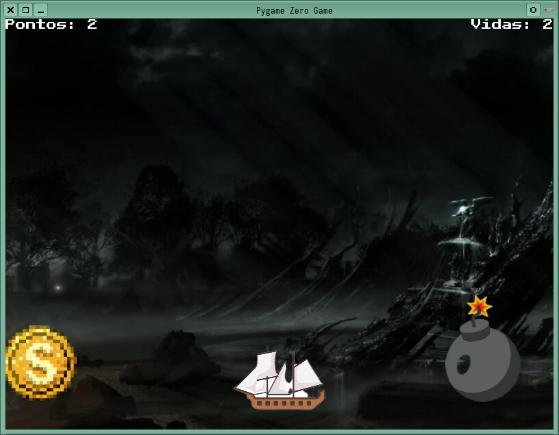

Pygame Zero com classe
===

Na aula passa escrevemos um jogo que está totalmente funcional dentro das regras que estabelecemos para ele.

Vamos refinar esse mesmo jogo, usando a programação orientada a objetos para que as regras fiquem mais compactadas dentro de cada elemento do jogo. Cada uma deles será entendido como um objeto, definidos em uma classe.



<!-- end_slide -->

Pygame Zero com classe
===

# O jogo tem início igual ao anterior, importando bibliotecas e definindo as dimensões da janela.
```python
from random import randint

WIDTH = 800
HEIGHT = 600
```

# Primeiro vamos definir a classe dos objetos que caem, eles têm praticamente os mesmo comportamento, exceto pelo incremento de pontos (moedas) e decremento de vidas (bomba)
```python
class Item(Actor):
    global HEIGHT

    vel = 7
```

A definição dessa classe `Item` é herdeira da classe `Actor`, isso significa que iremos montar a moeda da forma idêntica como fizemos anteriormente, sem necessitar posicioná-la logo de cara:
```pyhton
coin = Item('coin')
bomb = Item('bomb')
```
tudo que precisamos fazer seja com  bomba seja com a moeda, redefinimos a classe.

<!-- end_slide -->

Pygame Zero com classe (`tesouro-class.py`)
===

# Até o momento!
```python
from random import randint

WIDTH = 800
HEIGHT = 600


class Item(Actor):
    global HEIGHT

    vel = 7


coin = Item('coin')
bomb = Item('bomb')
```
Até o momento apenas definimos que a classe `Item` herdará a classe `Actor` e usará a variável global `HEIGHT` que definirá o piso da tela do jogo, além da variável `vel` que podemos mudar quando o objeto for utilizado em `coin` ou `bomb`.

Vamos desenhar os elementos já usando a lógica do `game_over` aprendida anteriormente.

<!-- end_slide -->

Pygame Zero com classe (`tesouro-class.py`)
===

Iniciando a variável `game_over` e desenhando todos elementos na tela:
```python
game_over = False


def draw():
    global game_over

    if not game_over:
        screen.blit('background',(0,0))
        coin.draw()
        bomb.draw()
    
    else:
        screen.blit('background',(0,0))
        screen.draw.text(f'Game Over', (400,300),\
            fontname='pixel', color=(255,255,255),\
            fontsize=30)
```

<!-- end_slide -->

Pygame Zero com classe (`tesouro-class.py`)
===

# Até o momento!

```python
from random import randint

WIDTH = 800
HEIGHT = 600


class Item(Actor):
    global HEIGHT

    vel = 7


coin = Item('coin')
bomb = Item('bomb')

game_over = False


def draw():
    global game_over

    if not game_over:
        screen.blit('background',(0,0))
        coin.draw()
        bomb.draw()
    
    else:
        screen.blit('background',(0,0))
        screen.draw.text(f'Game Over', (400,300),\
            fontname='pixel', color=(255,255,255),\
            fontsize=30)
```
Experimente virar a chave da variável `game_over` definindo ela como `True` para visualizar a tela de `Game Over`.

<!-- end_slide -->

Pygame Zero com classe (`tesouro-class.py`)
===

Melhorando a classe `Item` para definir a posição e a dinâmica de queda

```python
class Item(Actor):
    global HEIGHT

    vel = 7


    def set_pos(self):
        self.midtop = randint(20,780), 0


    def update(self):
        self.y += self.vel
        if self.bottom > HEIGHT:
            self.set_pos()    
```

E então faça o update no jogo, não esqueça de definir a posição logo depois que atribuir os objetos:
```python
# essa linha é logo após de coin=Item('coin')
coin.set_pos()
# essa linha é logo após bomb=Item('bomb')
bomb.set_pos()


def update():
    if not game_over;
        coin.update()
        bomb.update()
```

<!-- end_slide -->

Pygame Zero (`tesouro-class.py`)
===

# Até o momento!

<!-- column_layout: [1, 1] -->

<!-- column: 0 -->
## Definições
```python
from random import randint

WIDTH = 800
HEIGHT = 600


class Item(Actor):
    global HEIGHT

    vel = 7

    def set_pos(self):
        self.midtop = randint(20,780), 0


    def update(self):
        self.y += self.vel
        if self.bottom > HEIGHT:
            self.set_pos()    
        


coin = Item('coin')
coin.set_pos()
bomb = Item('bomb')
bomb.set_pos()

game_over = False
```

<!-- column: 1 -->

## Desenho e dinâmica
```python
def draw():
    global game_over

    if not game_over:
        screen.blit('background',(0,0))
        coin.draw()
        bomb.draw()
    
    else:
        screen.blit('background',(0,0))
        screen.draw.text(f'Game Over', (400,300),\
                         fontname='pixel', color=(255,255,255),
                         fontsize=30)


def update():
    if not game_over:
        coin.update()
        bomb.update()
```
<!-- reset_layout -->
E vai ver uma chuva de moedas e bombas.

<!-- end_slide -->

Pygame Zero (`tesouro-class.py`)
===

# Agora vamos criar o objeto `Hero` para definir o comportamento do navio
```python
class Hero(Actor):
    global WIDTH

    vel = 7


    def update(self):
        if keyboard.left or keyboard.a:
            ship.x -= self.vel
            if ship.left < 0: # Parede à esquerda
                ship.left = 0
        if keyboard.right or keyboard.d:
            ship.x += self.vel
            if ship.right > WIDTH: # Parede à direita`
                ship.right = WIDTH


ship = Hero('ship', midbottom=(WIDTH/2,HEIGHT))
```

Essa é a mesma dinâmica de movimento aprendida anteriormente, ao atribuirmos o objeto em `ship` já posicionamos ele, não há necessidade de um método de `set_pos` nessa classe pois não precisamos reposicionar ela a todo momento.  Falta apenas desenhar e atualizar o navio no jogo:

```python
def draw():
    global game_over

    if not game_over:
        screen.blit('background',(0,0))
        coin.draw()
        bomb.draw()
        ship.draw()
    
    else:
        screen.blit('background',(0,0))
        screen.draw.text(f'Game Over', (400,300),\
                         fontname='pixel', color=(255,255,255),
                         fontsize=30)


def update():
    if not game_over:
        coin.update()
        bomb.update()
        ship.update()
```
Agora temos um navio sob uma chuva de moedas e bombas.

<!-- end_slide -->

Pygame Zero (`tesouro-class.py`)
===

# Até o momento!

<!-- column_layout: [1, 1, 1] -->

<!-- column: 0 -->
## Imports e definições de classes
```python
from random import randint

WIDTH = 800
HEIGHT = 600


class Item(Actor):
    global HEIGHT

    vel = 7

    def set_pos(self):
        self.midtop = randint(20,780), 0


    def update(self):
        self.y += self.vel
        if self.bottom > HEIGHT:
            self.set_pos()    
            

 class Hero(Actor):
    global WIDTH

    vel = 7


    def update(self):
        if keyboard.left or keyboard.a:
            ship.x -= self.vel
            if ship.left < 0: 
                ship.left = 0
        if keyboard.right or keyboard.d:
            ship.x += self.vel
            if ship.right > WIDTH: 
                ship.right = WIDTH
```
<!-- column: 1 -->

## Atribuições de objetos
```python
ship = Hero('ship', midbottom=(WIDTH/2,HEIGHT))

coin = Item('coin')
coin.set_pos()
bomb = Item('bomb')
bomb.set_pos()

game_over = False
```

<!-- column: 2 -->

## Desenho e dinâmica
```python
def draw():
    global game_over

    if not game_over:
        screen.blit('background',(0,0))
        coin.draw()
        bomb.draw()
        ship.draw()
    
    else:
        screen.blit('background',(0,0))
        screen.draw.text(f'Game Over',\
            (400,300), fontname='pixel',\
            color=(255,255,255), fontsize=30)


def update():
    if not game_over:
        coin.update()
        bomb.update()
        ship.update()
```
<!-- reset_layout -->
E vai ver uma chuva de moedas e bombas com um barco sob elas.

<!-- end_slide -->

Pygame Zero (`tesouro-class.py`)
===

# Implementando a colisão na classe `Hero` e atualizando na dinâmica do jogo
```python

class Hero(Actor):
    global WIDTH

    vel = 7
    life = 3
    score = 0

    ...


    def collide(self, item, c=1):
        if self.collidrect(item):
            if c>0: self.score += c
            else: slef.life += c


...


def update():
    if not game_over:
        ...
        ship.collide(coin)
        ship.collide(bomb, -1)

        if ship.life == 0:
            game_over = True
```
Não esqueça que os `...` significam repetir todo o código que já existia anteriormente.

Vamos adicionar a seleção de efeito sonoro e reposicionamento após colisão no slide com todo o programa, tente identificar as linhas.

Não esqueça de incluir a pontuação e a quantidade de vidas também, não muda em nado do que já foi feito

<!-- end_slide -->

Pygame Zero (`tesouro-class.py`)
===

# Até o momento!

<!-- column_layout: [1, 1, 1] -->

<!-- column: 0 -->
## Imports e definição da classes `Item`
```python
from random import randint

WIDTH = 800
HEIGHT = 600


class Item(Actor):
    global HEIGHT

    vel = 7

    def set_pos(self):
        self.midtop = randint(20,780), 0


    def update(self):
        self.y += self.vel
        if self.bottom > HEIGHT:
            self.set_pos()
            
    
    def set_sound(self, som):
        self.som = som.play()
```
<!-- column: 1 -->

## Definição da classe `Hero` e atribuições de objetos
```python
 class Hero(Actor):
    global WIDTH

    vel = 7
    life = 3
    score = 0


    def update(self):
        if keyboard.left or keyboard.a:
            ship.x -= self.vel
            if ship.left < 0: 
                ship.left = 0
        if keyboard.right or keyboard.d:
            ship.x += self.vel
            if ship.right > WIDTH: 
                ship.right = WIDTH
                
                
    def collide(self, item, c=1):
        if self.collidrect(item):
            if c>0: self.score += c
            else: slef.life += c
            item.set_pos()
            item.som()
                
                
ship = Hero('ship', midbottom=(WIDTH/2,HEIGHT))

coin = Item('coin')
coin.set_pos()
coin.set_sound(sounds.coleta)
bomb = Item('bomb')
bomb.set_pos()
bomb.set_sound(sounds.explosao)

game_over = False
```

<!-- column: 2 -->

## Desenho e dinâmica
```python
def draw():
    global game_over

    if not game_over:
        screen.blit('background',(0,0))
        coin.draw()
        bomb.draw()
        ship.draw()
        screen.draw.text(f'Pontos:\
            {ship.score}', topleft=(0,0),\
            fontname='pixel',\
            color=(255,255,255),\
            fontsize=15)
        screen.draw.text(f'Vidas: {ship.life}',\
            topright=(800,0), fontname='pixel',\
            color=(255,255,255), fontsize=15)
    
    else:
        screen.blit('background',(0,0))
        screen.draw.text(f'Game Over',\
            (400,300), fontname='pixel',\
            color=(255,255,255), fontsize=30)
        screen.draw.text(f'Pontos: \
            {ship.score}', (370,350),\
            fontname='pixel',\
            color=(255,255,255),\
            fontsize=15)


def update():
    if not game_over:
        coin.update()
        bomb.update()
        ship.update()

        ship.collide(coin)
        ship.collide(bomb, -1)

        if ship.life == 0:
            game_over = True
```
<!-- reset_layout -->
O jogo está exatamente idêntico como deixamos na aula anterios, só mais organizado.
